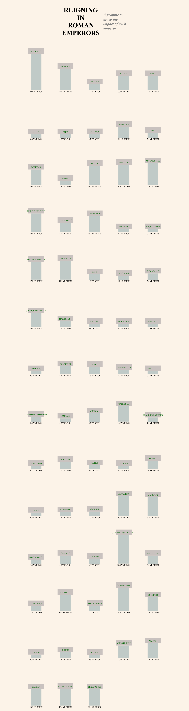

# vue-d3-emperors
## A project for the data visualization society. 
### Thank you to Amelia Wattenberger for taking time to tutor me!



## Project setup
```
npm install
```

### Compiles and hot-reloads for development
```
npm run serve
```

### Compiles and minifies for production
```
npm run build
```

### Lints and fixes files
```
npm run lint
```

### Customize configuration
See [Configuration Reference](https://cli.vuejs.org/config/).
